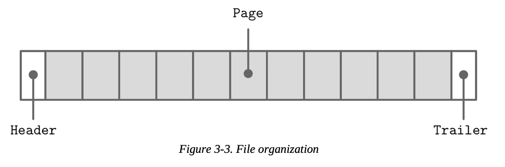
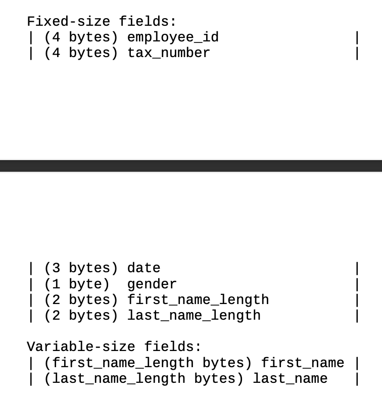
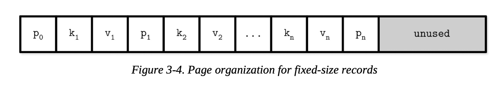
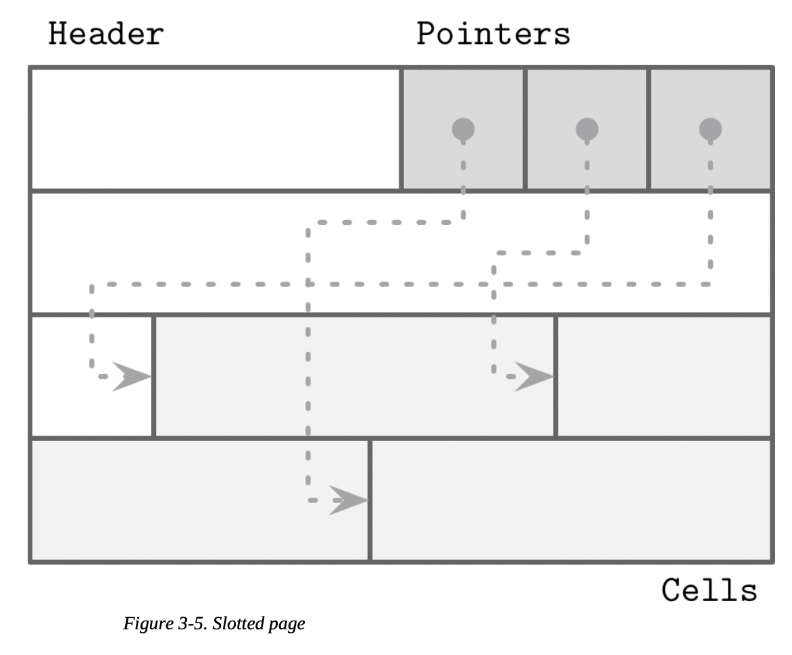
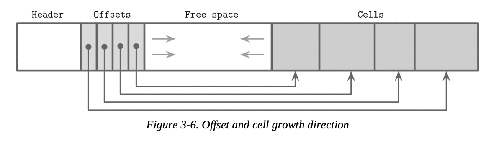
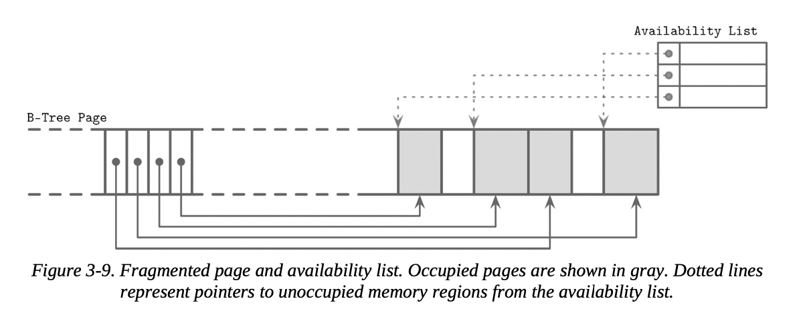

# 파일 포맷을 설계하는 일반적인 원칙

파일 포맷을 설계할 때는 주소 체계를 어떻게 할 지 먼저 결정해야 한다.
예를 들면 파일을 동일 크기의 페이지로 분할할 지 말 지를 결정하는 경우가 있다.
만약 동일 크기의 페이지로 분할한다면 하나의 블록 또는 연속적으로 이어진 블록에 데이터를 저장할 것이다.

- B-Tree (in-place update storage)
보통 B-Tree 와 같은 in-place 방식의 자료구조는 고정 크기의 페이지를 사용하여 분할함으로써 디스크에 엑세스하는 횟수를 줄인다.

- LSM (append-only storage)
레코드를 추가할 때는 메모리에 일단 추가된 내용을 반영했다가, 모든 추가가 마무리되면 페이지 단위로 한번에 디스크에 쓴다.

고정된 크기의 페이지로 분할하여 파일을 구성하는 대표적인 레이아웃은 고정된 크기의 header 로 시작하고, 고정된 크기의 trailer 로 끝내도록 앞 뒤를 구성한 뒤, 그 사이를 고정된 크기의 페이지로 분할하는 것이다.

파일은 저장하고 있는 데이터의 정해진 스키마 정보를 포함해서 갖고 있다.
여기에서는 필드 개수, 순서, 각 필드의 타입과 크기같은 정보가 들어간다.

이런 스키마 정보를 파일의 특정 영역에 정의해둠으로써 데이터를 저장할 때 필드 정보를 중복해서 저장하지 않고 더 많은 데이터를 효율적으로 저장할 수 있다.

이 그림은 스키마를 저장하는 모습을 나타낸 예시이며, 고정 크기 필드와 가변 크기 필드 정보를 나열한 모습을 보여준다.

가변 크기의 필드 정보는 해당 필드 데이터의 길이와, 그 데이터의 시작 위치 (offset) 정보를 함께 저장하여 접근하거나, 데이터 길이를 기반으로 직접 시작위치부터 계산해서 접근할 수 있다.

조금 더 복잡한 구조를 설계할 때는 보통 계층적으로 구성하는데,
원시타입을 조합하여 필드를
필드를 조합하여 셀을
셀을 조합하여 페이지를
페이지를 조합하여 섹션을
섹션을 조합하여 레전을 구성하는 방식이 대표적인 예시

이런 계층적 구성 방법은 내 필요에 맞게 결정하면 되고, 정해진 방법은 없다.

데이터베이스 파일은 여러 부분으로 구성된다.
파일 탐색에 도움을 주고, 파일 각 부분의 시작 위치를 가리키는 lookup table 을 활용한다.
이때 lookup table 은 header, trailer, 별도 파일 등 다양한 곳에 둘 수 있다.

## 페이지 구조
데이터베이스의 데이터를 저장하는 '데이터 파일' 과 '인덱스 파일'은 '페이지' 라고 부르는 단위로 구성되어있다.

B-Tree 의 경우 트리를 구성하는 각 노드는 크게 데이터를 갖고 있는 '단말 노드' 와 키만 갖고 있는 '비단말 노드' 로 구분할 수 있으며, 각 노드는 하나 또는 여러개로 연결된 페이지를 통해 표현되므로 '노드', '페이지', '블록' 이라는 용어를 구분하지 않고 사용하는 경우가 많다.

고정된 크기의 레코드를 저장하는 B-Tree 의 경우, 위 그림과 같이 페이지가 구성되어있다.
먼거 하나의 노드는 (k, v, p) 라는 조합으로 구성되어있고, 제일 처음에 0번째 포인터가 존재한다.
이때 k 는 키 값을, v 는 연관된 값을, p 는 자식 노드의 페이지 아이디를 저장한다.

이와 같이 페이지를 구성하는 것은 간단하지만 몇 가지 문제점이 있다.

- 오른쪽 공간에 키를 추가하는 것은 쉽지만, 왼쪽에 키를 추가하는 것은 노드 레이아웃의 재구성을 일으킨다.

- 고정 크기 레코드에 대해서만 쓸 수 있으며, 가변 크기 레코드를 관리할 수 없다.

따라서 이런 문제를 해결하기 위해 Slotted-Page 라는 기법을 사용하여 페이지를 구성한다.

## Slotted Page
가변 크기의 레코드를 저장할 때 발생하는 제일 큰 문제는 **삭제된 레코드의 공간을 관리하는 것**이다.
삭제된 레코드의 크기가 n 일 때, 새로 넣으려는 데이터의 크기가 n 이하라면 그 공간에 할당할 수 있겠지만, n보다 크다면 그 공간에 넣을 수 없으므로 해당 공간은 n의 크기로 빈채로 남아있고, 다른 공간 또는 새로운 페이지에 레코드를 저장하게 된다.

이런 여유 공간을 관리하는 과정을 단순하게 만들기 위해서 하나의 파일을 고정된 크기의 페이지로 나누고, 반드시 고정된 크기의 페이지 단위로 데이터를 관리하는 방법을 생각할 수 있다.
다만 이 경우, 하나의 데이터를 여러 페이지에 걸쳐 저장했을 때, 마지막 페이지에서 여유공간이 많이 남는 문제가 생길 수 있다.

또한 여유 공간을 모아서 하나로 만드는 작업은 단순히 데이터를 새로운 페이지에 옮겨 쓰는 것이 전부가 아니라, 각 포인터가 가리키고 있는 페이지 오프셋도 신경써서 옮겨주어야 한다.
따라서 다음과 같은 특징을 갖는 파일 포맷 (페이지 레이아웃) 이 핑료한 것이다.

- 최소한의 오버헤드로 가변 크기 레코드를 저장할 수 있어야 한다.
- 레코드 삭제 시 생긴 여유 공간을 모을 수 있어야 한다.
- 페이지 내부 레코드의 실제 위치와 상관없이 레코드를 참조할 수 있어야 한다.

이를 할 수 있는 페이지 레이아웃 구성 방법이 바로 Slotted Page 이다.

slotted page 의 레이아웃은 위와 같이 header, pointer 리스트, cell 리스트로 구성된다.
각 포인터는 그 offset 에 해당하는 cell 의 위치를 가리키고 있꼬, 각 cell 은 해당 페이지의 실제 데이터가 저장되어 있다.
헤더의 크기는 정해져있으며, 포인터와 셀에 대한 중요한 정보를 가지고 있다.

이렇게 구성함으로써

- '각 셀에 대한 포인터' 라는 최소한의 오버헤드로 가변 크기 레코드를 저장하고 있으며
- 레코드 삭제 시 여유 공간은 cell 의 재배치로 모을 수 있고,
- 페이지 내부 레코드의 실제 위치 (cell의 위치) 와 상관없이 pointer 로 외부에서 접근하므로, 외부에서는 레코드의 실제 위치를 몰라도 오프셋만 가지고 조회할 수 있다.

## 셀 레이아웃
셀은 지난 주 정리했던 원시타입, enum, flag 같은 데이터를 사용하여 구성된다.
셀은 크게 key cell 과 key-value cell 로 나눌 수 있다.
key cell 은 키 값과, 키와 인접한 양쪽의 두 포인터 사이의 페이지에 대한 포인터 값을 갖는다.
key-value cell 은 key 값과 해당 키에 연관된 데이터 레코드 데이터를 갖고 있다.

이때 우리는 키의 형식이 모두 한 종류로 통일되어 있다고 가정한다.
(모두 키만 갖고 있거나, 모두 키-값을 갖고 있거나)
따라서 각 파일의 메타데이터로서 해당 파일이 가진 키의 형태를 상단에 미리 저장해둠으로써, 키의 형태를 모든 셀에 중복 저장하는 것을 방지한다.

key cell 은 크게 cell type, key size, key bytes, child page id 4가지 데이터를 갖고 있다.
만약 key cell 의 크기가 고정되어 있다면 key size 항목은 필요하지 않다.
key-value cell 은 크게 cell type, key size, value size, key bytes, data record bytes 형태로 구성되어 있다.

이때 우리는 자식 페이지의 실제 주소가 아니라 page id 만 알고 있어도 된다.
왜냐하면 각 페이지의 크기가 특정 크기로 고정되어있다고 가정하기 때문에, 이 오프셋 값으로 실제 주소를 추정할 수 있기 때문이다.

각 cell 들을 하나의 페이지로 결합할 때는 위 그림과 같이 오프셋이 오른쪽으로 증 가하고, 실제 셀은 왼쪽으로 증가하는 방향으로 페이지가 채워진다.
이때 각 key 값의 데이터 순서는 cell 이 아니라 pointer 를 통해 논리적으로 나타낸다.
따라서 cell 위치에서는 정렬되어 있지 않더라도 pointer 를 정렬하여 둠으로써 실제로는 마치 페이지 내부 key 값이 정렬되어잇는 것과 같은 효과를  볼 수 있다.

### 가변 크기 데이터 관리

페이지 내에서 셀을 삭제한다고 실제 셀을 바로 삭제하지는 않는다.
대신 포인터를 삭제하고 해당 셀은 수정 가능한 형태로 availability list 에 표시해둔다.

새로운 셀을 삽입할 때는 먼저 availability list 를 체크해서 넣을 수 있는 cell 이 있다면 헤당 셀에 넣고, 없으면 셀을 재구성한 뒤 새로운 셀을 추가하거나 오버플로우 페이지를 만들어 저장하는 방법을 취한다.

이때 availability list 에서 넣을 수 있는 셀이 여러개 있을 때 셀을 선택하는 방법에는, 제일 먼저 발견한 셀에 넣는 first fit, 여유 공간을 최소한으로 남기는 best fit 등의 알고리즘을 사용할 수 있다.

### versioning
파일 포맷은 데이터베이스가 업데이트 되면서 변할 수 있다.
하지만, 이전 포맷의 형식으로 저장된 데이터도 여전히 지원해야 한다.
따라서 파일 포맷 자체에 버전을 매겨서 각 버전별 적합한 포맷을 선택하여 직렬화,역직렬화를 하도록 한다.

### checksum
또한 파일의 데이터가 망가졌는지 확인하기 위해 체크섬, 해시 등을 사용하여 파일의 상태를 체크하기도 한다.
체크섬은 제일 약한 수준의 보안 검사이다.